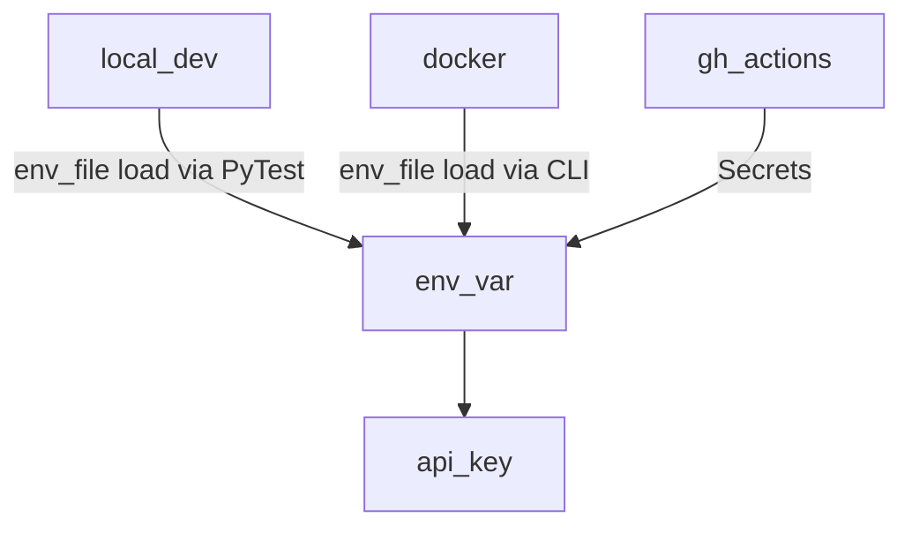

# porch_light

## TODO
- Get Photo from month name
- Get colors from photo
- Set light to colors from photo ONLY if on
- Listen for hook indicating time to change color
- At end of run, check if light is still on
- If light is off, go back to waiting for hook

- https://pypi.org/project/extcolors/
- https://python-pillow.org/
- https://gist.github.com/yunjey/14e3a069ad2aa- https://python-pillow.org/3adf72dee93a53117d6

## Development setup
- Need Python > 3.10 Installed

- Install Go-Task
- Linux
  - sudo snap install task --classic;

## Python setup
```sh
task setup; task test;

```
## Deploy
```sh 
task deploy
```

## Secrets
**API keys are stored in env vars, plain and simple**



Module              | Packages
-|-
Code Formatting     | black, isort
Style enforcement   | flake8
Static types        | mypy
Git hooks           | pre-commit
Testing             | pytest, pytest-cov. pytest-pycharm

```text
 .
├──  .coveragerc               --> Coverage
├──  .dockerignore             --> Docker
├──  .editorconfig             --> Maintain consistent coding style
├──  .github
│  └──  workflows              --> GH Actions
├──  .gitignore
├──  .pre-commit-config.yaml   --> Pre Commit config
├──  Dockerfile
├──  Pipfile                   --> Requirements
├──  Pipfile.lock
├──  porch_light
│  ├──  __init__.py
│  └──  porch_light.py
├──  README.md
├──  setup.cfg                 --> Command defaults
└──  test
   ├──  __init__.py
   └──  test_porch_light.py
```
