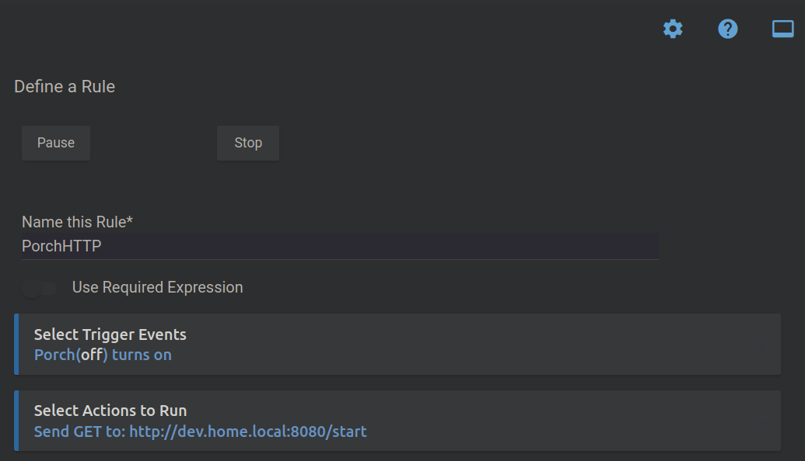
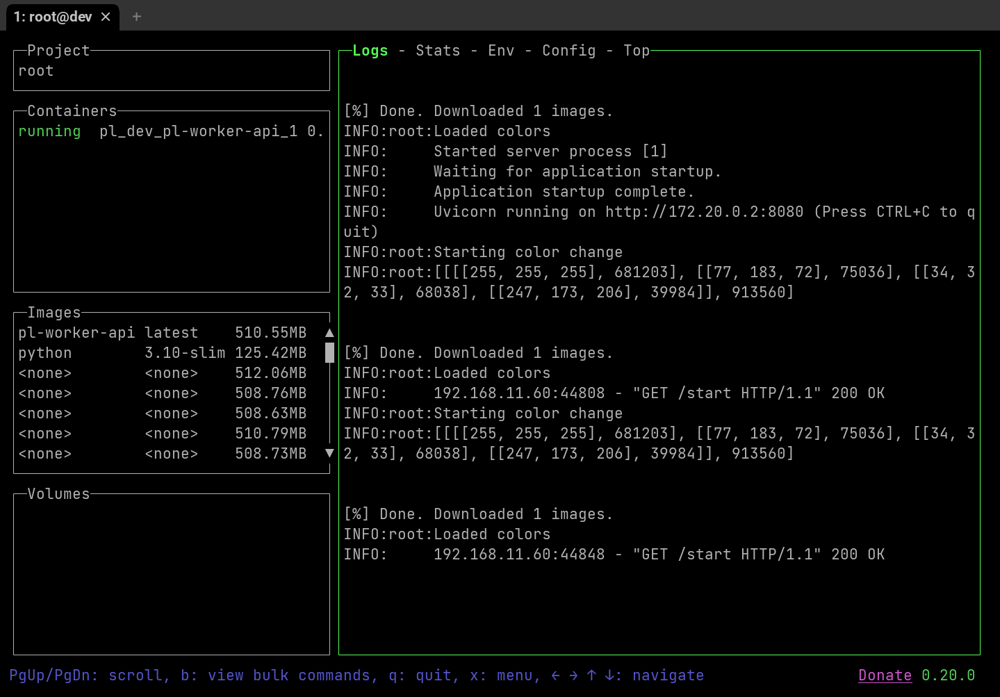

# porch_light

[](https://github.com/Jelloeater/porch_light/actions/workflows/codeql.yml)
[](https://github.com/Jelloeater/porch_light/blob/main/LICENSE)

## Intro

This guide assumes you own a **Hubitat Elevation** home automation controller.

If you are interested in purchasing one, you can purchase a unit from the manufactures website at [hubitat.com](https://hubitat.com/products) or from [Amazon.com](https://www.amazon.com/Hubitat-Elevation-Home-Automation-Hub/dp/B07D19VVTX/)

# How to use
## STEP 1:
- Setup env file

```shell
cp .env.example .env
```

- Fill in API keys in the .env file
  - See [Maker API Documentation](https://docs2.hubitat.com/en/apps/maker-api) for how to add the `MakerAPI` application and to generate new API keys
  - If you are using the cloud API endpoint for access, you will ALSO need to include the Cloud API key as well

## STEP 2:
- You will need to deploy the application on a Linux VM with Docker installed
- The easiest thing to do is to copy your .env file and let Docker Compose handle the rest
- Just make sure to remove it after you've deployed, so you don't leave your API keys lying around :-)
- Having SSH keys setup will make the deployment easier
- You can also just copy the whole repo over manually and run the below docker commands

```shell
# You can run this from the repo root, just fill in your VM name
rsync -av --filter=':- .gitignore' . root@YOUR_VM:/pl_dev/
rsync .env root@YOUR_VM:/pl_dev/.env
ssh root@YOUR_VM 'cd /pl_dev/; docker-compose build; docker-compose up -d;' # Setup Env on remote box
rsync -av --delete --filter=':- .gitignore' . root@YOUR_VM:/pl_dev/
```

## STEP 3:
- You will need to setup a Rule Machine action on the Hubitat itself https://docs2.hubitat.com/en/apps/rule-machine
  - This action should do a GET request to the HTTP API Server running on Docker
  - You will want to GET to the /start endpoint
  

## STEP 4:
- Profit! 
- You now have a color changing light bulb based on image keywords!


<3 Lazydocker

## Open Issues


See https://github.com/Jelloeater/porch_light/issues

## Dev Setup

Install Go-Task --> <https://taskfile.dev/installation/>

```shell
task setup
task docker_build_and_run
```

# Testing

```shell
task test
```
